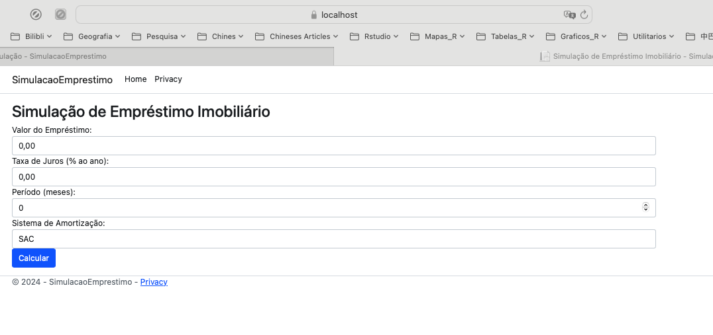
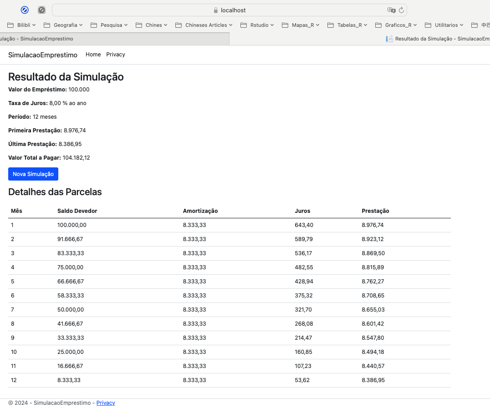

## Simulação de Empréstimo Imobiliário

## Descrição
Esta aplicação web em ASP.NET Core permite aos usuários simular um empréstimo imobiliário, oferecendo opções de amortização SAC e PRICE. A aplicação pode ser consumida via API ou carregada através de páginas Razor.

## Versão do .NET
Esta aplicação foi desenvolvida utilizando .NET 8.0.

## Arquitetura
A aplicação foi projetada para ser flexível e reutilizável, considerando o seu concumo microserviços ou como biblioteca. O serviço de simulação (`SimulacaoService`) pode ser consumido de duas formas:
- **Via API**: Permite que sistemas desenvolvidos em outras linguagens e frameworks consumam o serviço.
- **Como Biblioteca**: Permite que o serviço de simulação seja reutilizado dentro de outros módulos do sistema.

### Avaliação da Complexidade vs. Simplicidade
A tarefa de calcular uma simulação de empréstimo é relativamente simples, envolvendo entradas do usuário, um cálculo matemático e a exibição do resultado. No entanto, é importante considerar a complexidade adicional ao escolher a arquitetura do sistema. Usar DDD (Domain-Driven Design) e padrões como Repository pode ser excessivo para uma tarefa simples, resultando em overengineering que dificulta a manutenção e a compreensão do código, além de aumentar os custos de manutenção sem ganhos significativos em flexibilidade para uma lógica de negócio estática. Por outro lado, uma abordagem modular oferece vantagens em termos de escalabilidade e evolução, permitindo que a aplicação cresça em complexidade de maneira mais gerenciável. Além disso, a independência da infraestrutura facilitada por uma arquitetura modular permite mudanças na forma de armazenamento de dados com mínima refatoração. A modularidade também promove o reuso de código e facilita a testabilidade, melhorando a qualidade geral do código.

### Conclusão
Manter a Simplicidade Inicialmente: Para uma tarefa simples, uma abordagem inicial simples é recomendada.
Planejar para Escalabilidade: Planejar para o futuro com uma estrutura modular que suporte crescimento é uma prática prudente.
Neste projeto, optamos por uma abordagem que mescla a modularização com a simplicidade. Garantimos que a aplicação possa ser utilizada para tarefas simples, como o cálculo da amortização, mas também permitindo seu consumo em projetos maiores. A aplicação, por exemplo, não tem ciência da infraestrutura de banco de dados utilizada, e o padrão Repository permite o uso de armazenamento in-memory, mas também possibilita a implantação posterior em um servidor SQL ou NoSQL, entre outros, sem grande trabalho de refatoração.

## Funcionalidades
- Simulação de empréstimo com amortização SAC e PRICE.
- Exibição detalhada dos resultados da simulação.
- Consumo via página Razor e API REST.

## Fórmulas

### Sistema de Amortização Constante (SAC)

1. **Cálculo da Amortização Mensal**:
   \[
   A = \frac{P}{n}
   \]
   Onde:
   - \( A \) é a amortização mensal
   - \( P \) é o valor do empréstimo
   - \( n \) é o número de meses do período

2. **Cálculo da Taxa de Juros Mensal**:
   \[
   i_m = \left(1 + \frac{i_a}{100}\right)^{\frac{1}{12}} - 1
   \]
   Onde:
   - \( i_m \) é a taxa de juros mensal
   - \( i_a \) é a taxa de juros anual

3. **Cálculo dos Encargos Mensais**:
   \[
   E_m = A + (S_d \times i_m)
   \]
   Onde:
   - \( E_m \) é o encargo mensal
   - \( A \) é a amortização mensal
   - \( S_d \) é o saldo devedor

### Sistema PRICE

1. **Cálculo da Taxa de Juros Mensal**:
   \[
   i_m = \left(1 + \frac{i_a}{100}\right)^{\frac{1}{12}} - 1
   \]
   Onde:
   - \( i_m \) é a taxa de juros mensal
   - \( i_a \) é a taxa de juros anual

2. **Cálculo da Prestação Mensal**:
   \[
   E = \frac{P \times i_m}{1 - \left(1 + i_m\right)^{-n}}
   \]
   Onde:
   - \( E \) é a prestação mensal
   - \( P \) é o valor do empréstimo
   - \( i_m \) é a taxa de juros mensal
   - \( n \) é o número de meses do período

3. **Cálculo dos Encargos Mensais**:
   \[
   E_m = E
   \]
   Onde:
   - \( E_m \) é o encargo mensal
   - \( E \) é a prestação mensal

## Deploy

### Pré-requisitos
- .NET 8.0 SDK
- Docker (para deploy via Docker)

### Instruções para Deploy

#### Deploy Local

1. **Clonar o repositório**:
   ```bash
   git clone https://github.com/aniellima/SimuladorEmprestimo.git
   cd SimuladorHabitacional
2. **Restaurar as dependências**:
   ```bash
   dotnet restore
   ```
3. **Compilar a aplicação**:
   ```bash
   dotnet build
   ```
4. **Executar a aplicação**:
   ```bash
   dotnet run --project SimulacaoEmprestimo.csproj
5. **Acessar a aplicação**:

   - Via browser: https://localhost:5001 (página Razor)
   - Via API: https://localhost:5001/api/swagger (Swagger UI)

#### Deploy via Docker:

1. **Clonar projeto:**
   ```bash
   git clone https://github.com/aniellima/SimuladorEmprestimo.git
   cd SimuladorHabitacional
   ```
2. **Construir e executar os containers**:
   ```bash
   docker-compose up --build
   ```
3. **Acessar a aplicação**:
   - Via browser: http://localhost:8080 (página Razor)
   - Via API: http://localhost:8080/api/swagger (Swagger UI)

## Telas

### Tela Inicial



### Tela de Resultados



## Autoria
Este projeto foi desenvolvido por Aniel Lima. Sinta-se à vontade para contribuir e entrar em contato para quaisquer dúvidas.
